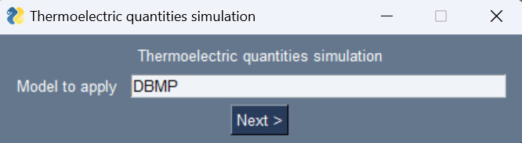
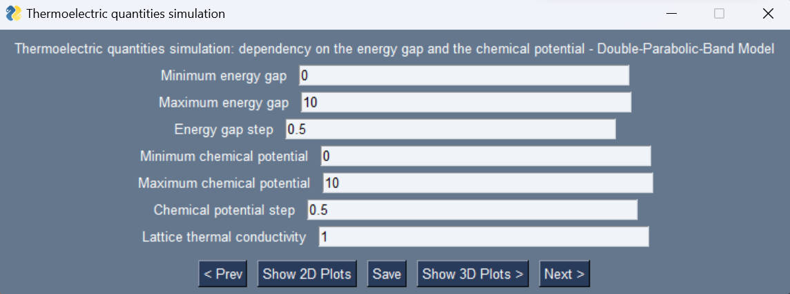
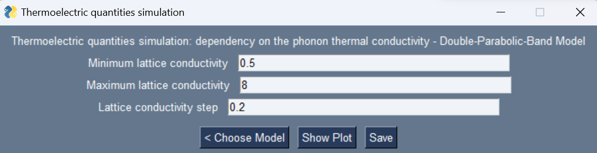
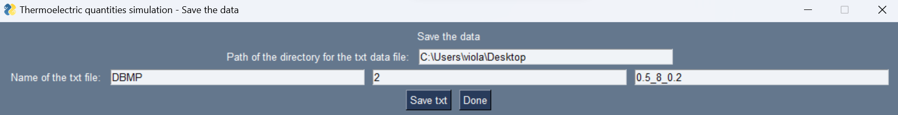

# Performance Simulation of Thermoelectric Materials
This software allows to calculate properties of 2D thermoelectric materials depending on their band structure. This is useful to estimate the performance of thermoelectric materials and understand how they can be optimized.

# 1. Introduction
Thermoelectric materials are able to convert a temperature gradient into electrical energy, or vice-versa. Since the majority of primary energy is wasted as heat, the development of thermoelectric devices is essential to utilize this waste heat and convert it into useful electric power. To continue this research and to direct it towards the realization of novel thermoelectric materials, simulations that, based on the characteristics of the material, are able to compute the
thermoelectric quantities of such materials are of crucial importance

This software contains allows to calculate the following quantities characterizing 2D thermoelectric materials:
- Seebeck coefficient $S$
- electric conductivity $\sigma$
- thermal electronic conductivity $\kappa_e$
- figure of merit $ZT$

The most important result is the figure of merit $ZT$, which characterizes thermoelectric materials: the higher the $ZT$ value, the better the performance of the material. 

The software takes the band structure of the material as a starting point. 
The simulation can be done based on three different models describing the band structure:
- single-parabolic-band model
- double-parabolic-band model
- double-Dirac-band model

All three models are based on Boltzmann transport theory in the linear response regime in the relaxation-time approximation.

In the end, the computed thermoelectric quantities depend on three main parameters: the energy gap, the chemical potential and on the thermal lattice conductivity.

# 2. Setup
## 2.1 Using Anaconda
### (a) Clone the repository
```
git clone https://github.com/ViolaFerretti/Thermoelectric_Quantities_Simulation.git

```
### (b) Install packages
In the Anaconda Prompt, install the necessary packages in python3: 
- to manage calculations:
```
conda install numpy
conda install scipy
conda install mpmath
```
- to visualize data
```
conda install matplotlib
```
- to set parameters and perform the simulations
```
conda install -c conda-forge pysimplegui
```
### (c) Run the software
Run the software with one of the environments, for example in Spyder.
## 2.2 Using Windows
### (a) Clone the repository
```
git clone https://github.com/ViolaFerretti/Thermoelectric_Quantities_Simulation.git

```
### (b) Install packages
In the Anaconda Prompt, make sure that you have all the needed packages in python3: 
- to manage calculations:
```
pip install numpy
pip install scipy
pip install matplotlib
pip install mpmath
```
- to visualize data
```
pip install matplotlib
```
- to set parameters and perform the simulations
```
pip install PySimpleGUI
```
### (c) Run the software
```
python3 GUI.py
```
# 3. Start
## 3.1 Model selection
### Single-parabolic-band model
The single parabolic band model assumes that only one band participates in the charge transport. This assumption can be justied in materials with relatively large band gaps (with respect to the targeted operational temperature range). SPB modeling has been employed successfully
in many material systems like $Mg_2(Si,Sn)$, $ZnSb$, $Bi_2Te_3$ and $PbTe$. A single band is, of course,
not enough to capture the complete picture of the material when more than one majority carrier
band and/or minority carrier bands are contributing substantially to charge transport. 
However, in the case of a highly doped sample single-parabolic-band model is a correct description over the entire
temperature range.

To apply this model, write "SBMP" (the first three letter distinguish between Single-Band Model and Double-Band Model, and the last one selects the approximation, being either Parabolic or of Dirac type) in the first window of the graphic interface. 

### Double-parabolic-band model
The single-band model is not sufficient to describe moderately or lightly doped materials, for
which a double-band model is required, being the simplest and, in most cases, sufficient improvement. A very promising class of materials, is that of members of $Mg_2X$ (with $X = Si$, $Ge$, $Sn$)
and their solid solutions, which can be correctly described by the double-parabolic-band model.

To apply this model, write "DBMP" in the first window of the graphic interface. 

### Double-Dirac-band model
A lot of research efforts and grants have especially been invested on the 2D materials whose electronic structure can be modeled by the Dirac Hamiltonian, or the so-called 2D Dirac materials.
Dirac matter is any material where the low-energy excitation spectrum can be described by the
Dirac equation ($E \propto k$) rather than the more usual quadratic dispersion ($E \propto k^2$
), considered
in the two previous models. The examples of 2D Dirac materials include graphene, silicene,
germanene, transition metal dichalcogenides (TMDs), and hexagonal boron nitride. Some of
them possess excellent electronic and thermal properties, and some recent findings may indicate
the possibilities of 2D Dirac materials as good thermoelectrics.

To apply this model, write "DBMD" in the first window of the graphic interface. 

*Example: select the Double-Parabolic-Band model*



## 3.2 The simulation
By solving the Boltzmann equations within the selected model and the relaxation-time approximation, one finds that the Seebeck coefficient $S$, the electric conductivity $\sigma$ and thermal electronic conductivity $\kappa_e$ are given by:
```math
\begin{equation}
		\begin{cases}
			\sigma=q^2L_0\\\\
			S=\frac{1}{qT}\frac{L_1}{L_0}\\\\
			\kappa_e=\frac{1}{T}\left(L_2-\frac{L_1^2}{L_0}\right)
		\end{cases}
	\end{equation}
```
Then, the final figure of merit $ZT$ is computed through the folowing equation:
 ```math
\begin{equation}
			ZT=\frac{S^2\sigma T}{\kappa_e+\kappa_L}
\end{equation}
```
where $\kappa_L$ is the lattice thermal conductivity.
## 3.2.1 First part: energy gap and chemical potential
In this first part, the focus is ont the dependency of thermoelectic quantities on energy gap and chemical potential, while the lattice thermal conductivity is kept fixed.
### Single-parabolic-band model
If the chosen model is a double-band one, the next window allows the user to insert the following parameters:
- minimum value of the chemical potential
- maximum value of the chemical potential
- step to consider in the chemical potential range
- thermal lattice conductivity
  
**Details on the calculations**
$L_i$ is the transport integral, given by:
```math
\begin{equation}
		L_{i}=\int\mathcal{T} (E)(E-\mu)^i\left(-\frac{\partial f}{\partial E}\right)dE
\end{equation}
```

$\mu$ is the chemical potential (in $eV$), or the Fermi energy $E_F$ as long as the temperature is less than $10^2 K$, which is the vast majority of the cases of interest. $E$ is the energy of the charge carrier and $f_0=\frac{1}{\exp\left(\frac{E-E_F}{k_BT}\right)+1}$ is the Fermi-Dirac distribution function. In addition, one has:
```math
\begin{equation}
		\mathcal{T} (E)=v^2(E)\tau(E)\mathcal{D}(E)
\end{equation}
```

where $v$ is the group velocity, $\tau$ is the relaxation time and $\mathcal{D}$ is the density of states of the carriers, defined in $J^{-1}m^{-3}$.	Assuming that short-range impurity scattering dominates:
```math
\begin{equation}
		\tau (E)=C\left[D(E)\right]^{-1}
\end{equation}
```

where $C$ is the scattering coefficient (dimensions $W^{-1}m^{-3}$), that depends on the DOS through the material dimensions and the confinement length. This condition can be derived from Fermi's golden rule and is suitable for scattering mechanisms involving electron-phonon interactions (occurring at 300-700 K).
To work with dimensionless quantities, the reduced chemical potential $\eta=\mu/k_BT$ is introduced. The integrals $ L_i $ can be written in function of simpler integrals $F_i$, given by:
```math
\begin{equation}
		F_i(\eta)=\int \eta^if_0d\eta
\end{equation}
```
Thus one has:
```math
  \begin{equation}
  		\begin{cases}
  			L_0=\frac{C}{m}\left(k_BT\right)F_0\\\\
  			L_1=\frac{C}{m}\left(k_BT\right)^2\left(2F_1-\eta F_0\right)\\\\
  			L_2=\frac{C}{m}\left(k_BT\right)^3\left(3F_2-4\eta F_1+\eta^2F_0\right)
  		\end{cases}
  	\implies\ 
  	\begin{cases}
  		\sigma=\frac{q^2C}{m}\left(k_BT\right)F_0\\\\
  		S=\frac{k_B}{q}\frac{\left(2F_1-\eta F_0\right)}{F_0}\\\\
  		\kappa_e=\frac{k_B^3T^2C}{m}\left(3F_2-4\eta F_1+\eta^2F_0-\frac{\left(2F_1-\eta F_0\right)^2}{F_0}\right)
  	\end{cases}
  \end{equation}
```
with $m$ and $q$ the effective mass and the charge of the carrier.
By defining the constants $S_0=\frac{k_B}{q}\simeq87\mu V/K$, $\sigma_=\frac{q^2C}{m}$ and $\kappa_0=\frac{k_B^3T^2C}{m}$ one gets:
```math
\begin{equation}
		\begin{cases}
			\sigma=\sigma_0F_0\\\\
			S=S_0\frac{\left(2F_1-\eta F_0\right)}{F_0}\\\\
			\kappa_e=\kappa_0\left(3F_2-4\eta F_1+\eta^2F_0-\frac{\left(2F_1-\eta F_0\right)^2}{F_0}\right)
		\end{cases}
\end{equation}
```

In the end, one can compute the final figure of merit $ZT$:
 ```math
\begin{equation}
			ZT=\frac{S^2\sigma T}{\kappa_e+\kappa_L}
\end{equation}
```
where $\kappa_L$ is the lattice thermal conductivity, which is kept fixed in this part.
### Double-band models
If the chosen model is a double-band one, the next window allows the user to insert the following parameters:
- minimum value of the energy gap
- maximum value of the energy gap
- step to consider in the energy gap range
- minimum value of the chemical potential
- maximum value of the chemical potential
- step to consider in the chemical potential range
- thermal lattice conductivity 

*Example: first part of the study with Double-Parabolic-Band model*



**Details on the calculations**

**(a) Double-parabolic-band model**
The mathematical procedure is similar to the one applied for the single-band model. In fact, the thermoelectric quantities still depend on the transport integrals $L_i$, which take the same form as before. The difference is that now both a valence and a conduction band and the energy gap between the two are considered. In addition, bands are considered symmetric. This is useful to describe the bipolar effect due to the presence of both negative and positive charge carriers, i.e. electrons in the conduction band and holes in the valence band. Therefore, now the transport integrals are distinguished between the two bands:
```math
 \begin{equation}
		\begin{cases}
			L_{i,c}=\int_{0}^{\infty}\mathcal{T} (E)(E-\mu)^i\left(-\frac{\partial f}{\partial E}\right)dE\\\\
			L_{i,v}=\int_{-\infty}^{0}\mathcal{T} (E)(E-\mu)^i\left(-\frac{\partial f}{\partial E}\right)dE
		\end{cases}
	\end{equation}
```
Their relations with the functions $F_i$ is the following:
```math
 \begin{equation}
		\begin{cases}
			L_{i,c}=\frac{g\tau_0}{2\pi\hbar^2L}\left(k_BT\right)^{i+1}\left[F_{i+1,c}\left(\eta-\delta\right)+\left(\eta-\delta\right)F_{i,c}\left(\eta-\delta\right)\right]\\\\
			L_{i,v}=L_{i,c}=-\frac{g\tau_0}{2\pi\hbar^2L}\left(k_BT\right)^{i+1}\left[F_{i+1,v}\left(\eta+\delta\right)+\left(\eta+\delta\right)F_{i,v}\left(\eta-\delta\right)\right]
		\end{cases}
	\end{equation}
```
where $L$ is the confinement length, $g$ accounts for degeneracy, and $\delta=\Delta/k_BT$, $\Delta$ being such that $E_g=2\Delta$.
The $F_i$ integrals are given by:
```math
	\begin{equation}
			\mathcal{F}_{i,c(v)}(\eta)=\int_{-\eta\ (-\infty)}^{\infty\  (-\eta)}\frac{x^ie^x}{(e^x+1)^2}dx
	\end{equation}
```
Assuming electron-hole symmetry, i.e.:
```math
	\begin{equation}
		\begin{cases}
			\mathcal{F}_{0,c}(\eta)=\mathcal{F}_{0,v}(-\eta)\\
			\mathcal{F}_{1,c}(\eta)=-\mathcal{F}_{1,v}(\eta)\\
			\mathcal{F}_{2,c}(\eta)=\mathcal{F}_{2,v}(-\eta)\\
		\end{cases}
	\end{equation}
```
and defining $\sigma_0=\frac{g\tau_0e^2k_BT}{4\pi\hbar^2L}$, $S_0=k_B/e$ and $\kappa_0=\frac{g\tau_0k^3_BT^2}{4\pi\hbar^2L}$, one gets:
```math
 \begin{equation}
		\begin{cases}
			\sigma_{c(v)}=\sigma_0\mathcal{F}_{0,c(v)}\\\\
			S_{c(v)}=-S_0\frac{\mathcal{F}_{1,c(v)}}{\mathcal{F}_{0,c(v)}}\\\\
			\kappa_{e,c(v)}=\kappa_0\left(\mathcal{F}_{2,c(v)}-\frac{\mathcal{F}_{1,c(v)}^2}{\mathcal{F}_{0,c(v)}}\right)
		\end{cases}
	
	\end{equation}
```
The physical quantities to compute are now:
```math
 \begin{equation}
		\begin{cases}
			\sigma=\sigma_c+\sigma_v\\\\
			S=\frac{\sigma_cS_c+\sigma_vS_v}{\sigma_c+\sigma_v}\\\\
			\kappa_e=\frac{\sigma_c\sigma_v}{\sigma_c+\sigma_v}\left(S_c-S_v\right)^2+\left(\kappa_{e,c}+\kappa_{e,v}\right)
		\end{cases}
	
	\end{equation}
```
and eventually $ZT$ is calculated through the same equation used previously. The parameters to be set by the user are $\mu$ and $\delta$, while $\kappa_L$ is kept fixed.

**(b) Double-Dirac-band model**
Because this is a double-band model, the procedure follows the steps of the simulation for parabolic bands. However, now the transport integrals $L_i$ are dependent on both the integrals of type $F_i$ and on new functions $G_i$:
```math
	\begin{equation}
		L_{i,c(v)}=\frac{Cv_F^2(K_BT)^i}{2}\left(\mathcal{F}_{i,c(v)}(\eta-\delta)-\mathcal{G}_{i,c(v)}(\delta,\eta)\right)
	\end{equation}
```
with:
 ```math
	\begin{equation}
		\begin{cases}
			\mathcal{F}_{i,c(v)}(\eta)=\int_{-\eta\ (-\infty)}^{\infty\  (-\eta)}\frac{x^ie^x}{(e^x+1)^2}dx\\\\
			\mathcal{G}_{i,c(v)}(\delta,\eta)=\int_{\delta-\eta\ (-\infty)}^{\infty\  (-\delta-\eta)}\frac{\delta^2}{(x+\eta)^2}\frac{x^ie^x}{(e^x+1)^2}dx
		\end{cases}
	\end{equation}
```
In the end, applying the same procedure of the double-parabolic-band model, one finds $\sigma$, $S$, $\kappa_e$ in units of $\sigma_0=e^2v_F^2C/2$, $S_0=k_B/e$ and $\kappa_0=v_F^2Ck_B^2T/2$, respectively; eventually $ZT$ is computed. The parameters to be set by the user are $\mu$ and $\delta$, while $\kappa_L$ is kept fixed.

## Data visualization
If the selected model is the single-parabolic-band one, the user can visualize the 2D plot of the thermoelectric quantity with respect to the chemical potential by clicking on "Show Plots".

When working with double-band models, the user has two choices to visualize the computed thermoelectric quantities:
- by selecting "Show 2D plots", the graphs of each quantity will be shown on the y-axis with respect to the chemical potential on the x-axis, for the different values of energy gap
- by selecting "Show 3D plots, the graphs of each quantity will be shown on the z-axis with respect to both the chemical potential and the energy gap, which vary on the x-y plane; this visualization can be useful to have a better understanding of how the three parameters depend simultaneously on each other.

## 3.2.2 Second part: the role of lattice thermal conductivity
The expression of $ZT$ tells that a bigger value of the figure of merit can be obtained with higher thermopower and electrical conductivity and a small thermal conductivity. Thermal conductivity has two contributions, one from electrons, analyzed before, and the other from the lattice (phonons).
$\kappa_e$ can vary but cannot be lowered much, because the electric conductivity $\sigma$ (to me maximized) depends on it through Franz-Wiedemann's law relation:
```math	
\begin{equation}
		\kappa_e=L_0T\sigma
\end{equation}
 ```
where $L_0=2.45\times 10^4\mu V^2K^{-2}$ is the Lorenz number.
Therefore, one must act on $\kappa_L$, which in general is defined through the following equation:
 ```math
	\begin{equation}
		\kappa_L=\frac{1}{3}\nu_sc_s\lambda_{ph}
	\end{equation}
 ```
where $\nu_s$ and $c_s$ are the frequency and the speed of sound respectively, and $\lambda_{ph}$ is the wavelength of phonons oscillations.  In the end, ideal thermoelectric materials are those that have a low lattice thermal conductivity (phonon glass) and a low resistivity (electron crystal). Indeed, for a phonon glass the phonons have a short mean free path (lattice vibrations are not relevant) and for an electron crystal the electrons have high mean free path (current flows easily).
The lowest value that can be reached by acting on $\lambda_{ph}$ is $\kappa_L^{min}\simeq0.25\ W/mK$ (phonon glass). To better understand how the thermoelectric quantities depend on this parameter, the lattice thermal conductivity can be written can be written in units of $\kappa_0$ as $\kappa_L=r_{\kappa}\kappa_0$, where $ r_{\kappa} $ is a parameter that can be changed by the user during the simulation, and $\kappa_0$ is defined in each model (seen previously).

In this second part, the parameters to indicate are:
- minimum of $r_{\kappa}$
- maximum of $r_{\kappa}$
- step to consider in the $r_{\kappa}$ range

*Example: second part of the study with Double-Parabolic-Band model*



### Single-parabolic-band model

In the single-parabolic-band model, $ZT$ depends now on two parameters: the chemical potential (whose role was analyzed in the first part) and the thermal lattice conductivity. Therefore, now the software computes $ZT$ for a fixed chemical potential range (that can be checked and modified in the GUI.py file) and the selected $r_{\kappa}$ range.

Thus, the software directly plots a 3D graph on $ZT$ depending on these two variables.

### Double-band models

In the case of double-band-models, the situation is more complex, because, as seen in the first part, $ZT$ already depends on cheical potential and energy gap; the addition of $\kappa_L$ makes $ZT$ a 3-variable function, which would be difficult to study. Therefore, the software gets rid of the chemical potential-dependency by only keeping the maximized value of $ZT$ with respect to it. In this way, one can analyze the 3D plot of $ZT$ with respect to energy gap and thermal lattice conductivity.

## 3.3 Save data

By clicking on "Save", the user can save the data by specifying:
- the path to save the data on
- the name of the file, indicating: sigle of the model + the part of the simulation ("1" for the first part and "2" for the second part) + additional specifications needed by the user

In this way, for the first part, the software will save chemical potential and thermoelectric quantities in the case of single-parabolic-band model, and also the energy gap in the case of double-band models. 

For the second part, the software will save chemical potential, thermal lattice conductivity and $ZT$ in the case of single-parabolic band, or thermal lattice conductivity, energy gap and $ZT$ for double-band models.

*Example: save data of the second part of the study with Double-Parabolic-Band model*



# 4. References
- Microscopic Kinetics and Thermodynamics course by Professor L. Pasquini at University of Bologna
- Mitra, Sunanda. Chalcogenide of type $IV-VI_2$ for thermoelectric applications. Diss. Université Paris Saclay (COmUE), 2016.
- Hung, Nguyen T., Ahmad RT Nugraha, and Riichiro Saito. "Universal curve of optimum thermoelectric figures of merit for bulk and low-dimensional semiconductors." Physical Review Applied 9.2 (2018): 024019.
- Naithani, Harshita, Eckhard Müller, and Johannes de Boor. "Developing a two-parabolic band model for thermoelectric transport modelling using $Mg_2Sn$ as an example." Journal of Physics: Energy 4.4 (2022): 045002.
- Hasdeo, Eddwi H., et al. "Optimal band gap for improved thermoelectric performance of two-dimensional Dirac materials." Journal of Applied Physics 126.3 (2019).
